# owner だけが使う Viewer と絶対の表示 URL

## 目的・対象外・未決事項

### 目的

`docs/superpowers/specs/` の仕様のうち未実装の部分を、owner 1 人が使える範囲で作り、spec を今の実装に合わせる。

- Viewer の `/` で自分の `projects` の行の一覧を見て、`/p/:projectId` でその `versions` の行を切り替えながら HTML を表示できる。HTML の中のスクリプトも動く
- 未ログインで Viewer を開くと auth のサインインへ送られ、サインインの後は開いた URL へ戻る
- api と MCP が返す表示 URL を絶対 URL にし、LLM が返したリンクをそのまま開ける
- `versions` の行の並びを挿入した順にし、`versions` に行を足したら `projects.updated_at` も更新する
- TanStack Query の hooks を配る package（`@karibari/api-query`）を作り、viewer はその hooks で api を読む（user の指示）
- spec（overall-arch・interfaces・tech-stack・move-api-auth-to-apps）を今の実装とこの設計に合わせる

### 対象外

- 招待・署名付き URL・`POST /api/projects/:project_id/shares`・auth の `POST /verify-access`（共有の機能と一緒に作る）
- サインアップの制限。今は GitHub でサインインすれば誰でも利用者になれる（招待の機能と一緒に閉じる）
- Viewer の要素単位コメント・HTML 編集・ログアウト・Viewer からの入稿・`shares` の一覧と失効の画面
- 日時（`projects.updated_at`・`versions.created_at`）を画面に出すこと（spec にもデザインにも無い）
- 404 の内訳をサーバのログに残すこと（interfaces-design の「エラーレスポンス形状」）

### 未決事項（1〜3 は user の承認で決定済み。4 は仮置き）

1. セッションの確認先は auth の `GET /api/auth/get-session` にする。viewer が better-auth の client で直接呼ぶ（user の指示。api に session の route を作る案は取りやめた）。auth の Worker に viewer の origin の CORS を足す（フェーズ 12）
2. HTML の表示枠は iframe の `src` に api の content の URL をそのまま使い、iframe の `sandbox` 属性と content の response の CSP をどちらも `sandbox allow-scripts` にする。スクリプトは opaque origin で動くので、cookie も api への認証付きの request も持てない。`localStorage` などを使うスクリプトは失敗する。R2 に本体が無いときの 404 は iframe の中に出る
3. デプロイの後に手で確かめる（E2E は api と auth を stub するので確かめられない。user と合意）
   - iframe の content の request に cookie が載り、HTML が表示される（viewer と api は同じ site `tsar-bmb.org` なので `SameSite=Lax` でも載る想定）
   - query の付いた callbackURL（`/p/:projectId?v=...`）で、サインインの後に元の URL へ戻る
4. api-query の query hook は、404 を例外にせず `null` で返す。API が「存在しない・権限が無い・未認証」をすべて 404 にする設計なので、404 は「見つからない」という結果として扱う。404 以外の非 2xx は例外にして、画面の error component に任せる

## 全体の図

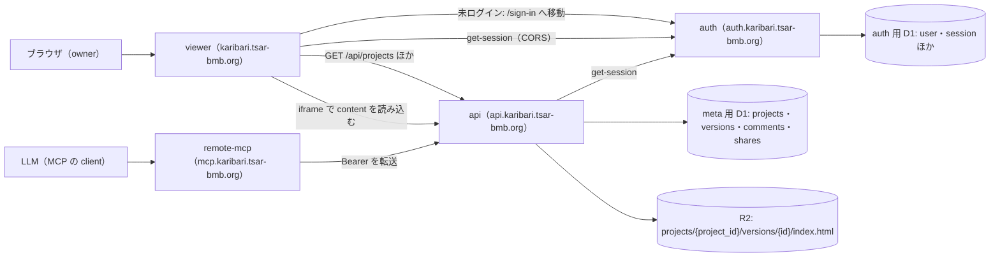

## 画面

`/` と `/p/:projectId` は認証ゲートの下に置く。見た目はデザインに任せる（デザインの URL は無い）。

#### /

自分の `projects` の行の一覧。入力は無い。api が返す順（`updated_at` の新しい順）に並べ、各行は `name`（null なら「無題」）を出し、`/p/:projectId` への link にする。0 行なら「まだありません。MCP の create_project で HTML を入稿すると、ここに出ます。」と出す。

- 開く → GET /api/projects。404 のときは何も描画しない（認証ゲートがサインインへ送る）
- 行を押す → `/p/:projectId` へ移動する

#### /p/:projectId?v=<versions.id>

1 つの `projects` の行の HTML を表示する。入力は無い。上に見出し（`/` への link・`projects.name`（null なら「無題」）・`versions` の行の選択）、その下の残りの高さすべてに HTML の表示枠を置く。選択肢は新しい行を上に並べ、ラベルは `versions.id`（UUID）をそのまま出す（user と合意）。

- 開く → GET /api/projects/:project_id と GET /api/projects/:project_id/versions。表示する行は `v` の `versions.id`、`v` が無ければ一覧の最後の行。HTML の表示枠がその行の content を読み込む。GET のどちらかが 404 か、`v` が一覧に無いときは 404 画面を出す
- 選ぶ → `/p/:projectId?v=<versions.id>` へ移動する（履歴に積む）
- `/` への link → `/` へ移動する

#### 404 画面（既存）

どの route にも当たらない path と、`/p/:projectId` の 404 のときに出す。

- 「ホームへ戻る」 → `/` へ移動する

## 流れ

link で画面を移る操作（`/` で行を押す・`/` への link・「ホームへ戻る」）は、移動先の画面を開く流れと同じなので、図を分けない。

### 流れ: viewer を起動する

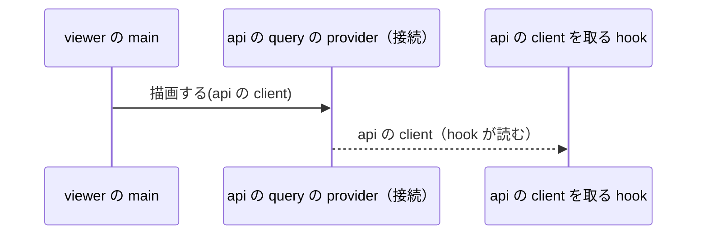

### 流れ: / を開く

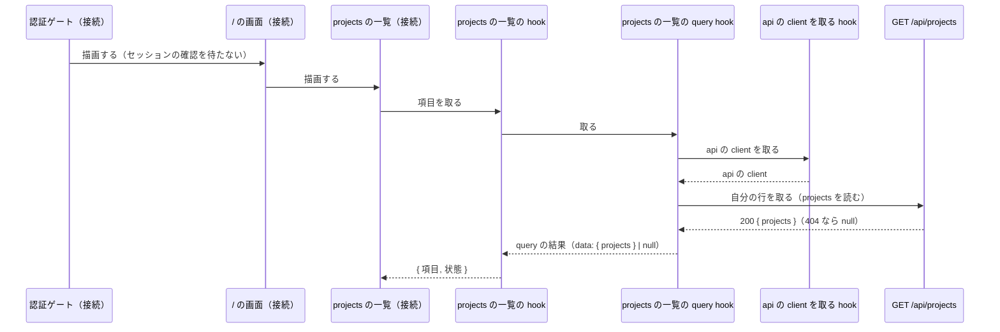

### 流れ: セッションが無いとき

`/` と `/p/:projectId` で同じ。

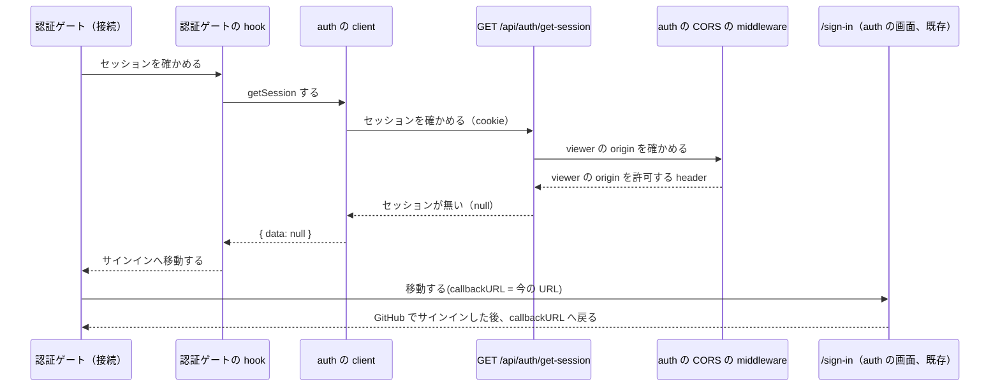

### 流れ: /p/:projectId を開く

セッションの確認は「流れ: セッションが無いとき」と同じ。

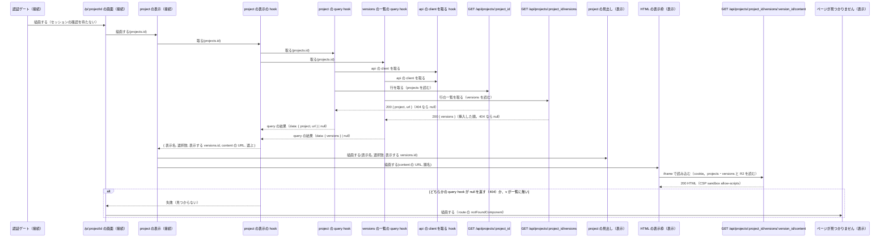

### 流れ: versions の行を選ぶ

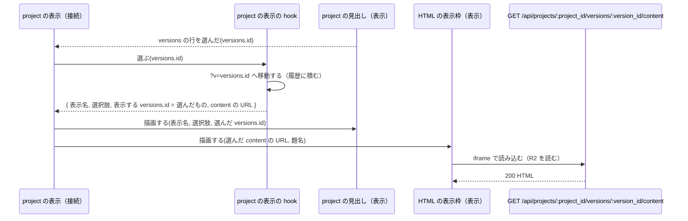

### 流れ: MCP で入稿する

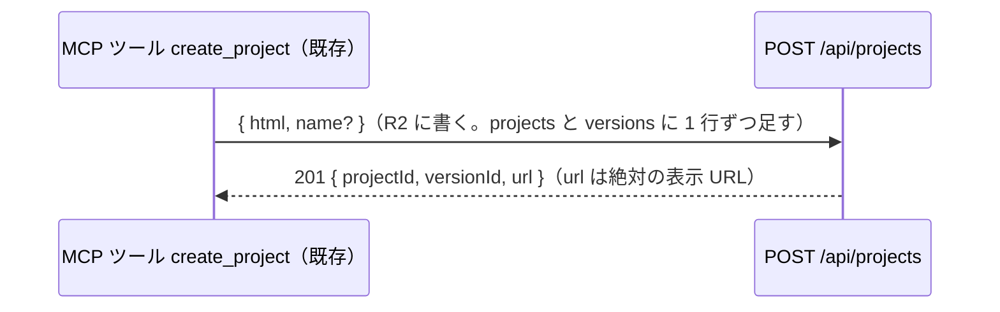

### 流れ: MCP で versions の行を足す

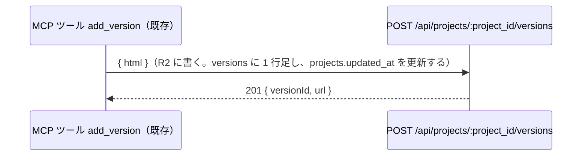

### 流れ: MCP でコメントを取る

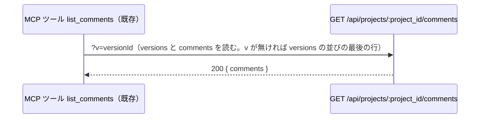

### 流れ: MCP で表示 URL を取る

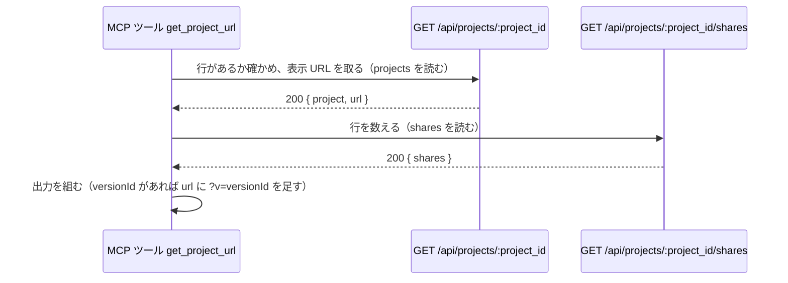

## 関数の木

```text
認証ゲート（接続）【4】
├── 認証ゲートの hook() → { サインインへ移動するか }【4】
│   └── auth の client（better-auth の client）【4】
│       └── GET /api/auth/get-session【12】
│           └── auth の CORS の middleware【12】
├── /sign-in（auth の画面、既存）
├── / の画面（接続）【2】
│   └── projects の一覧（接続）【2】【3】
│       └── projects の一覧の hook() → { 項目: { ID, 表示名 }[], 状態: 一覧 | 空 | 描画しない }【2】
│           └── projects の一覧の query hook() → query の結果（data: { projects } | null）【15】
│               ├── api の client を取る hook() → api の client【15】
│               │     失敗: provider の外で呼んだ
│               └── GET /api/projects（既存）
└── /p/:projectId の画面（接続）【3】
    │     受け取る: route の param（projects.id）
    ├── project の表示（接続）【3】
    │   │ 受け取る: projects.id
    │   ├── project の表示の hook(projects.id) → { 表示名, 選択肢: { versions.id }[], 表示する versions.id, content の URL, 選ぶ(versions.id) }【3】【14】
    │   │     失敗: 見つからない（query hook が null を返す, v が一覧に無い）
    │   │   ├── project の query hook(projects.id) → query の結果（data: { project, url } | null）【16】
    │   │   │   ├── api の client を取る hook()【15】
    │   │   │   └── GET /api/projects/:project_id【11】
    │   │   └── versions の一覧の query hook(projects.id) → query の結果（data: { versions } | null）【17】
    │   │       ├── api の client を取る hook()【15】
    │   │       └── GET /api/projects/:project_id/versions【8】
    │   ├── project の見出し（表示）【3】【14】
    │   │     受け取る: 表示名, 選択肢, 表示する versions.id
    │   │     知らせる: versions の行を選んだ(versions.id)
    │   └── HTML の表示枠（表示）【3】
    │       │ 受け取る: content の URL, 題名（表示名）
    │       └── GET /api/projects/:project_id/versions/:version_id/content【10】
    └── ページが見つかりません（表示）【2】

404 の route（既存）
└── ページが見つかりません【2】

viewer の main【2】
└── api の query の provider（接続）【15】
      受け取る: api の client（apps/viewer/src/lib/api-client.ts の既存の client）

MCP ツール create_project（既存）
└── POST /api/projects【6】

MCP ツール add_version（既存）
└── POST /api/projects/:project_id/versions【7】

MCP ツール list_comments（既存）
└── GET /api/projects/:project_id/comments【9】

MCP ツール get_project_url【13】
├── GET /api/projects/:project_id【11】
└── GET /api/projects/:project_id/shares（既存）
```

## 型と API

### データ

テーブルとカラムは `packages/db/src/schemas/`（meta 用 D1）と `packages/better-auth/src/auth-schema.ts`（auth 用 D1）にあり、この設計では変えない。meta 用 D1 の日時のカラムは epoch 秒の整数（auth 用 D1 はミリ秒）。api は行をカラム名のまま JSON にして返す。

- `projects` の行 = `{ id, name, owner, created_at, updated_at }`。`name` は null 可。`owner` は auth 用 D1 の `user.id`
- `versions` の行 = `{ id, project_id, created_at }`。HTML の本体は R2 の `projects/{project_id}/versions/{id}/index.html`
- `shares` の行 = `{ id, project_id, kind, token, key_id }`
- `versions` の並び【8】【9】: 同じ `project_id` の行を挿入した順に並べる。`created_at` は秒単位で、`id` はランダムな UUID なので、どちらでも同じ秒に入った行の順は決まらない。挿入した順は SQLite の暗黙の `rowid` で取る（`versions` は rowid のあるテーブルで、行を消さないので挿入した順に増える）。カラムは足さない。「最後の行」はこの並びの最後
- 表示 URL【6】【7】【11】= `<Viewer の origin>/p/<projects.id>`。`versions` の行を指すときは `<Viewer の origin>/p/<projects.id>?v=<versions.id>`。api の各 route がその場で組み立てる（フェーズごとに独立させるため、共有のモジュールにしない）。MCP は組み立てず、api の `url` を使う
- content の URL = `<api の origin>/api/projects/<projects.id>/versions/<versions.id>/content`
- サインインの URL【4】= `<auth の origin>/sign-in?callbackURL=<encodeURIComponent(今のページの URL)>`
- 表示名 = `projects.name`。null のときは「無題」
- `v` の parser【14】= URL の query `v`（`versions.id`、任意）を読み書きする nuqs の parser。書き込むと履歴に積む
- api の client【15】= `@karibari/api/client` の `createApiClient` の戻り値（hono の typed client）。viewer が作り、api の query の provider に渡す。`packages/api-query` は型だけを import する
- query の結果【15】【16】【17】= TanStack Query の結果。`data` は API が 200 のときの JSON、404 のときは `null`（未確定の間は `undefined`）。404 以外の非 2xx は例外（hono の `DetailedError`）を投げる
- auth の client【4】= better-auth の client（`better-auth/client` の `createAuthClient`）。baseURL は `VITE_AUTH_ORIGIN`、basePath は `/api/auth`、cookie を送る（`credentials: "include"`）。viewer が `apps/viewer/src/lib/auth-client.ts` に作る

### 設定

- api の `VIEWER_ORIGIN`（既存）= `https://karibari.tsar-bmb.org`。表示 URL の origin にも使う
- viewer の `VITE_API_ORIGIN`（既存）= `https://api.karibari.tsar-bmb.org`。content の URL の origin にも使う
- viewer の `VITE_AUTH_ORIGIN`【4】= `https://auth.karibari.tsar-bmb.org`。`.env` に置く。サインインの URL と auth の client の baseURL の origin にも使う
- api の client（既存）: viewer から api を呼ぶ型付きの client（`@karibari/api/client`）。cookie を送る設定は済んでいる

### API

404 の body はすべて `{ "error": "not_found" }`。認証が無い・無効・auth に問い合わせられないときも、既存の認証の middleware が 404 を返す。JSON の key は既存のものをそのまま書く。

#### GET /api/auth/get-session（変更）【12】

- auth の better-auth の既存の endpoint。変えるのは CORS だけ。viewer の origin（`https://karibari.tsar-bmb.org`）からの、cookie 付きの request を許可する。許可する origin は viewer の origin だけ
- response: セッションがあればセッションの JSON、無ければ `null`（better-auth の仕様）

#### POST /api/projects（変更）【6】

- 変えるのは 201 の `url` を絶対の表示 URL にすることだけ。request とほかの status は変えない
- response: 201 `{ projectId, versionId, url }` / 400 入力が不正 / 404 認証が無い

#### POST /api/projects/:project_id/versions（変更）【7】

- `versions` に 1 行足すとき、同じ `projects` の行の `updated_at` を足した行の `created_at` に更新する
- 201 の `url` を、足した行を指す絶対の表示 URL にする
- request: `{ html }`（変えない）
- response: 201 `{ versionId, url }` / 400 入力が不正 / 404 `projects` の行が無いか自分のものではない

#### GET /api/projects/:project_id/versions（変更）【8】

- 変えるのは並びだけ。「データ」の `versions` の並びにする
- response: 200 `{ versions }` / 404

#### GET /api/projects/:project_id/comments（変更）【9】

- 変えるのは `v` が無いときに使う `versions` の行だけ。「データ」の `versions` の並びの最後の行にする
- request: `?v=<versions.id>`（任意）
- response: 200 `{ comments }` / 404

#### GET /api/projects/:project_id/versions/:version_id/content（変更）【10】

- 変えるのは CSP だけ。`Content-Security-Policy: sandbox allow-scripts` にする。`X-Content-Type-Options: nosniff` は残す
- response: 200 HTML（`text/html`）/ 404

#### GET /api/projects/:project_id（変更）【11】

- 変えるのは response に `url`（絶対の表示 URL。`<Viewer の origin>/p/<projects.id>`）を足すことだけ。`project` は今までどおり行をそのまま返す
- response: 200 `{ project, url }` / 404

#### viewer が使う、変えない API

- GET /api/projects: 200 `{ projects }`（`updated_at` の新しい順）/ 404 認証が無い
- GET /api/projects/:project_id の `project`（viewer は `url` を使わない）

#### MCP ツール get_project_url（変更）【13】

- 入力: `{ projectId, versionId? }`（変えない）
- 出力: `{ projectId, shareCount, url, versionId? }`。`url` は GET /api/projects/:project_id の `url` で、`versionId` があれば `?v=<versionId>` を足す。MCP の側は Viewer の origin を持たない
- 使う API: GET /api/projects/:project_id【11】と GET /api/projects/:project_id/shares（既存）

## ファイルとフェーズ

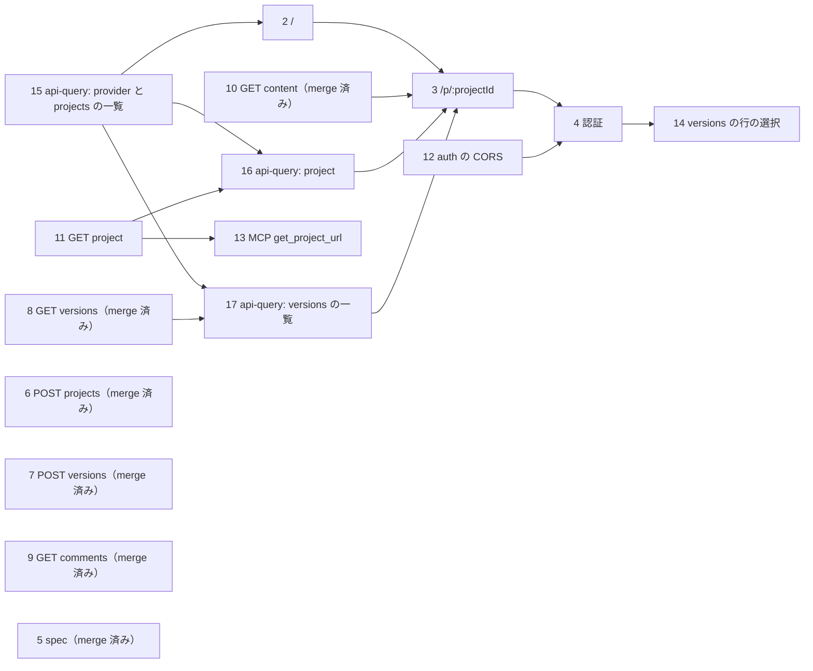

1 フェーズは 1 つの API（か 1 つの画面）だけを作り、1 つの package（`apps/*` か `packages/*`）だけを触る（user の指示。diff を小さくして review できるようにするため）。package に付いてくる変更（`knip.config.ts` の workspace の指定・`bun.lock`・root の `AGENTS.md` の Directory rules の表・spec の 1 行）は、同じフェーズに含める。次のファイルは、直列のフェーズが順に書き足す（直列なので同時には触らない）: `apps/viewer/src/router.tsx` は 2 → 3 → 4 → 14、`apps/viewer/test/helpers/api-stub.ts` は 2 → 3 → 4、`apps/viewer/src/routes/home/project-list/index.tsx` は 2 → 3、`use-project-view.ts`・`project-header.tsx`・`apps/viewer/test/e2e/project.spec.ts` は 3 → 14、`apps/viewer/package.json` は 2 → 4 → 14、`bun.lock` は 15 → 2 → 4 → 14、`knip.config.ts` は 15 → 2、`packages/api-query/src/index.ts` は 15 → 16・17（16・17 は並列に作ってよく、`index.ts` の行が衝突したら、後から merge する側が rebase する）。それ以外のファイルは 1 フェーズだけが持つ。viewer の画面のファイルの path は、下の「viewer の画面のファイルの置き方」に沿って決めてある。

| ファイル | 新規・変更 | 中身 | フェーズ |
| --- | --- | --- | --- |
| apps/viewer/src/router.tsx | 変更 | `/` の route を登録する | 2 |
| apps/viewer/src/routes/home.tsx | 新規 | / の画面 | 2 |
| apps/viewer/src/routes/home/project-list/index.tsx | 新規 | projects の一覧 | 2 |
| apps/viewer/src/routes/home/project-list/hooks/use-project-list.ts | 新規 | projects の一覧の hook | 2 |
| apps/viewer/src/components/not-found.tsx | 変更 | ページが見つかりません | 2 |
| apps/viewer/test/helpers/api-stub.ts | 新規 | E2E で api と auth への request を stub する補助 | 2 |
| apps/viewer/test/e2e/home.spec.ts | 新規 | E2E: `/` で行を押すと `/p/:projectId` へ移動する | 2 |
| knip.config.ts | 変更 | `apps/viewer` の `entry` の指定とそのコメントを外す | 2 |
| apps/viewer/src/main.tsx | 変更 | viewer の main | 2 |
| apps/viewer/package.json | 変更 | `@karibari/api-query`（`workspace:*`）を足す | 2 |
| bun.lock | 変更 | `bun install` の結果 | 2 |
| apps/viewer/src/router.tsx | 変更 | `/p/:projectId` の route を登録し、その `notFoundComponent` に `ページが見つかりません` を置く | 3 |
| apps/viewer/src/routes/home/project-list/index.tsx | 変更 | projects の一覧 | 3 |
| apps/viewer/src/routes/project.tsx | 新規 | /p/:projectId の画面 | 3 |
| apps/viewer/src/routes/project/project-view/index.tsx | 新規 | project の表示 | 3 |
| apps/viewer/src/routes/project/project-view/hooks/use-project-view.ts | 新規 | project の表示の hook | 3 |
| apps/viewer/src/routes/project/project-view/components/project-header.tsx | 新規 | project の見出し | 3 |
| apps/viewer/src/routes/project/project-view/components/html-frame.tsx | 新規 | HTML の表示枠 | 3 |
| apps/viewer/test/e2e/project.spec.ts | 新規 | E2E: `/` への link・404 から戻る | 3 |
| apps/viewer/test/e2e/not-found.spec.ts | 変更 | どの route にも当たらない path で開く | 3 |
| apps/viewer/test/helpers/api-stub.ts | 変更 | `/p/:projectId` の E2E に要る stub があれば足す | 3 |
| apps/viewer/src/router.tsx | 変更 | 認証ゲートを足し、`/` と `/p/:projectId` をその下に移す | 4 |
| apps/viewer/src/routes/session-gate.tsx | 新規 | 認証ゲート | 4 |
| apps/viewer/src/routes/session-gate/hooks/use-session-gate.ts | 新規 | 認証ゲートの hook | 4 |
| apps/viewer/.env | 変更 | `VITE_AUTH_ORIGIN` を足す | 4 |
| apps/viewer/src/vite-env.d.ts | 変更 | `VITE_AUTH_ORIGIN` の型を足す | 4 |
| apps/viewer/src/lib/auth-client.ts | 新規 | auth の client | 4 |
| apps/viewer/package.json | 変更 | `better-auth`（`catalog:`）を足す | 4 |
| bun.lock | 変更 | `bun install` の結果 | 4 |
| apps/viewer/test/helpers/api-stub.ts | 変更 | 既定で GET /api/auth/get-session をセッションありにする | 4 |
| apps/viewer/test/e2e/session-gate.spec.ts | 新規 | E2E: セッションが無いとサインインへ移動する | 4 |
| docs/superpowers/specs/2026-09-09-overall-arch-design.md | 変更 | phase-5-spec.md の一覧のとおり直す（merge 済み） | 5 |
| docs/superpowers/specs/2026-09-09-interfaces-design.md | 変更 | phase-5-spec.md の一覧のとおり直す（merge 済み） | 5 |
| docs/superpowers/specs/2026-09-09-tech-stack-design.md | 変更 | phase-5-spec.md の一覧のとおり直す（merge 済み） | 5 |
| docs/superpowers/specs/2026-09-11-move-api-auth-to-apps-design.md | 変更 | phase-5-spec.md の一覧のとおり直す（merge 済み） | 5 |
| apps/api/src/routes/projects/index.post.ts | 変更 | POST /api/projects | 6 |
| apps/api/test/routes/projects/index.post.spec.ts | 変更 | `url` の期待値を絶対の表示 URL にする | 6 |
| apps/api/src/routes/projects/[project_id]/versions/index.post.ts | 変更 | POST /api/projects/:project_id/versions | 7 |
| apps/api/test/routes/projects/[project_id]/versions/index.post.spec.ts | 変更 | `url` の期待値と、`projects.updated_at` の更新 | 7 |
| apps/api/src/routes/projects/[project_id]/versions/index.get.ts | 変更 | GET /api/projects/:project_id/versions | 8 |
| apps/api/test/routes/projects/[project_id]/versions/index.get.spec.ts | 変更 | 同じ `created_at` の行が挿入した順に並ぶこと | 8 |
| apps/api/src/routes/projects/[project_id]/comments/index.get.ts | 変更 | GET /api/projects/:project_id/comments | 9 |
| apps/api/test/routes/projects/[project_id]/comments/index.get.spec.ts | 変更 | `v` が無いとき、同じ `created_at` の `versions` の行のうち最後に挿入した行を使うこと | 9 |
| apps/api/src/routes/projects/[project_id]/versions/[version_id]/content.get.ts | 変更 | GET /api/projects/:project_id/versions/:version_id/content | 10 |
| apps/api/test/routes/projects/[project_id]/versions/[version_id]/content.get.spec.ts | 変更 | CSP の期待値 | 10 |
| apps/api/src/routes/projects/[project_id]/index.get.ts | 変更 | GET /api/projects/:project_id | 11 |
| apps/api/test/routes/projects/[project_id]/index.get.spec.ts | 変更 | response の `url` | 11 |
| apps/auth/src/middlewares/cors.ts | 新規 | auth の CORS の middleware | 12 |
| apps/auth/src/server.ts | 変更 | `/api/auth/*` に auth の CORS の middleware を足す（GET /api/auth/get-session が viewer から呼べる） | 12 |
| apps/auth/test/cors.spec.ts | 新規 | viewer の origin だけが許可されること | 12 |
| docs/superpowers/specs/2026-09-09-interfaces-design.md | 変更 | セッションの確認を auth の get-session に直す（`GET /api/session` の記述を取りやめる） | 12 |
| packages/mcp/src/tools/get-project-url-tool.ts | 変更 | MCP ツール get_project_url | 13 |
| packages/mcp/test/features/get-project-url.spec.ts | 変更 | api の `url` を使うこと。`versionId` があれば `?v=` を足すこと | 13 |
| docs/superpowers/specs/2026-09-09-interfaces-design.md | 変更 | MCP の公開 URL 取得の記述を、api の `url` を使う形に直す（1 行） | 13 |
| apps/viewer/package.json | 変更 | `nuqs`（`catalog:`）を足す | 14 |
| bun.lock | 変更 | `bun install` の結果 | 14 |
| apps/viewer/src/router.tsx | 変更 | root route に nuqs の adapter を足す | 14 |
| apps/viewer/src/routes/project/params.ts | 新規 | `v` の parser | 14 |
| apps/viewer/src/routes/project/project-view/hooks/use-project-view.ts | 変更 | project の表示の hook | 14 |
| apps/viewer/src/routes/project/project-view/components/project-header.tsx | 変更 | project の見出し | 14 |
| apps/viewer/test/e2e/project.spec.ts | 変更 | E2E: `versions` の行を選ぶと `?v=` へ移動する | 14 |
| packages/api-query/package.json | 新規 | api-query の package（依存・peer・`type-check` の script） | 15 |
| packages/api-query/tsconfig.json | 新規 | api-query の tsconfig | 15 |
| packages/api-query/AGENTS.md | 新規 | api-query の規約（下の「api-query の置き方」を書く） | 15 |
| packages/api-query/CLAUDE.md | 新規 | `@AGENTS.md` だけを書く | 15 |
| packages/api-query/src/index.ts | 新規 | api-query の公開面（named export） | 15 |
| packages/api-query/src/context.ts | 新規 | provider と hook が共有する context | 15 |
| packages/api-query/src/provider.tsx | 新規 | api の query の provider | 15 |
| packages/api-query/src/use-api.ts | 新規 | api の client を取る hook | 15 |
| packages/api-query/src/query/use-projects-query.ts | 新規 | projects の一覧の query hook | 15 |
| AGENTS.md | 変更 | Directory rules の表に `packages/api-query/**` の行を足す | 15 |
| knip.config.ts | 変更 | `packages/api-query` の workspace を足す | 15 |
| bun.lock | 変更 | `bun install` の結果 | 15 |
| packages/api-query/src/query/use-project-query.ts | 新規 | project の query hook | 16 |
| packages/api-query/src/index.ts | 変更 | 公開面に project の query hook を足す | 16 |
| packages/api-query/src/query/use-versions-query.ts | 新規 | versions の一覧の query hook | 17 |
| packages/api-query/src/index.ts | 変更 | 公開面に versions の一覧の query hook を足す | 17 |
| apps/api/src/middlewares/auth.ts | 既存 | 認証の middleware | — |
| apps/api/src/routes/projects/index.get.ts | 既存 | GET /api/projects | — |
| apps/api/src/routes/projects/[project_id]/shares/index.get.ts | 既存 | GET /api/projects/:project_id/shares | — |
| packages/mcp/src/tools/create-project-tool.ts | 既存 | MCP ツール create_project | — |
| packages/mcp/src/tools/add-version-tool.ts | 既存 | MCP ツール add_version | — |
| packages/mcp/src/tools/list-comments-tool.ts | 既存 | MCP ツール list_comments | — |
| apps/viewer/src/lib/api-client.ts | 既存 | api の client | — |

### viewer の画面のファイルの置き方

viewer の React は、user が決めた次の規約で書く（フェーズ 2・3・4・14 共通）。

- `.tsx` のトップレベルの関数は 1 ファイルに 1 つ。定数はいくつ置いてもよい。2 つ目の関数は別のファイルに分ける（Suspense の境界を張る component と、その中で suspend する component も別ファイルにする）
- 画面は、薄い route component の `src/routes/<画面>.tsx` と、中身を置く `src/routes/<画面>/` に分ける。route component は view を並べて Suspense の境界などを張る。route 自身が持つ関心（認証の確認のように、view に属さないもの）の hook は、画面のディレクトリの `hooks/` に置いて route component が呼んでよい。view が使う API の呼び出しは view の hook に置き、route component は取らない
- view は component のディレクトリ `<view>/` にし、置けるのは `index.tsx`（view 本体。関数は 1 つ）・`hooks/`（その view だけの hook と、その view だけが使う純関数）・`components/`（その view の内側だけで使う表示部品）だけ。内側の部品を `index.tsx` の隣に平置きしない。route が直接描画する view は、状態を出すだけでも component のディレクトリにする
- view と hook は 1:1 で、同じディレクトリに置く（`<view>/index.tsx` と `<view>/hooks/use-<view>.ts`）。API の呼び出しは api-query の query hook に任せ（viewer は `useSuspenseQuery` も `queryFn` も書かない）、view の hook はその結果を表示の形に整える（view は整形も判定もしない）。データの待ちは Suspense で表し（query hook の中の `useSuspenseQuery`）、fallback は `null`（読み込み中は何も描画しない）にして、`isLoading` は hook から返さない。query hook が `null`（404）を返したときの扱いは画面ごとに決める（`/` は何も描画しない、`/p/:projectId` は 404 画面）。404 以外の失敗は throw して router の既定の error component に任せる。例外は認証ゲートの確認だけで、これは auth の client（better-auth）の `getSession` を待たない `useQuery` で確かめ（api-query は api の route だけを扱うので、auth の呼び出しは含めない）、確認中も子を描画し、セッションが無いと確定（`data` が `null`）したときだけサインインへ移動する（フェーズ 4）
- 型は最小限にする。hook の戻り値は推論に任せ、表示部品の props は受け取る側のファイルに構造で直接書く。型だけのファイルは作らない
- 整形・集計は、同じ処理が view をまたいでも共有のモジュールに出さず、それぞれの hook に書く。共有してよいのは、画面の中でずれてはいけないものだけで、画面の `hooks/` に置く
- hook は引数なしで呼べる形にする。route の param のように hook の中では決められないものだけ、view の props で受けて hook の引数にする
- 自分の view のディレクトリの外にあるものは `@/` の alias で import し、`./` は同じ view のディレクトリの中（`./hooks/…`・`./components/…`）にだけ使う。`<owner>/components/` はその owner のディレクトリの外から import しない。複数の画面で共有するものは `src/components/`（UI）か `src/lib/`（UI でないもの）に置く
- UI は `@karibari/shadcn/components/<name>` を使う。要素の差し替えは `render={<Link … />}` で、`asChild` は無い。単一選択は `NativeSelect`、0 件の表示は `Empty`（画面の直下に置く `Empty` に `max-w-*` を付けない）。共有 component の base と同じ class を className で再指定しない
- URL に載せて共有すると同じ表示になる状態（`?v=` など）は nuqs で持つ。parser は画面の隣の `params.ts` にまとめる
- `if` 文の前には空行を置く（ブロックの先頭の `if` は除く）

### api-query の置き方

`packages/api-query`（`@karibari/api-query`）は、api の REST API を TanStack Query の hooks にして apps に配る、source-only の package（user の指示。build しない）。フェーズ 15 が `packages/api-query/AGENTS.md` に次の規約を書き、以後はそこが正になる。

- 構成は `src/index.ts`（公開面。named export を列挙し、`export *` は使わない）・`src/context.ts`・`src/provider.tsx`・`src/use-api.ts`・`src/query/use-<リソース>-query.ts`
- 1 route = 1 file。一覧は複数形、1 件は単数（`use-projects-query.ts`・`use-project-query.ts`）。リソース別のサブディレクトリは切らない。hook を 1 つ足す手順は、既存の query hook をコピーして route と query key を変え、`index.ts` に named export を 1 行足すだけにする
- 型は手書きしない。`data` の型は hono client の `InferResponseType`（200）に任せ、hook の戻り値は推論に任せる
- `queryFn` は、404 のとき `null` を返し、それ以外の非 2xx は hono の `parseResponse` で例外（`DetailedError`。`index.ts` から re-export する）にする。変換・retry・整形を hook に入れない（整形は app の view の hook）
- 画面の本体のデータを読む hook は `useSuspenseQuery`（待ちは Suspense で表す）
- provider は origin ではなく api の client を受け取る。`QueryClientProvider` は app が持ち、その内側に api の query の provider を置く。client の作り方（origin・cookie）は app の責務
- `@karibari/api` は型だけを import する（`import type`）。`@tanstack/react-query` と `react` は peer（版は root の catalog）
- テストは書かない。`type-check` が通れば足りる

## 記法

```text
関数       名前(引数, …) → 戻り値。戻り値が無ければ → を書かない
           失敗するときは、次の行に「失敗: 理由, …」
component  名前（表示 または 接続）。次の行に「受け取る: …」「知らせる: 名前(引数)」
hook       名前の hook(引数) → 表示の形。view（接続）と 1:1 で、query hook の結果を表示の形に整える。route 自身の関心の hook（認証ゲート）だけは画面の hooks/ に置いて route component が呼ぶ
query hook 名前の query hook(引数) → query の結果（data: …）。API の 1 route に 1 つで、packages/api-query に置く
形         { 項目, 項目? }。項目? は無いことがある。X[] は X の一覧。A | B はどちらか
型         名前から分からないときだけ「役割: owner | member」のように書く
印         【N】はフェーズ N で作る・変えるもの。（既存）は今あるものを使う
データ     DB のテーブルとカラムの名前で書く（versions.created_at）。既存の API の JSON は実際の key で書く
```
