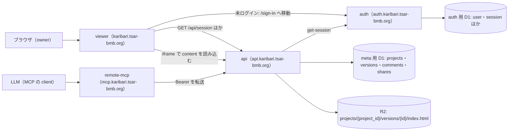
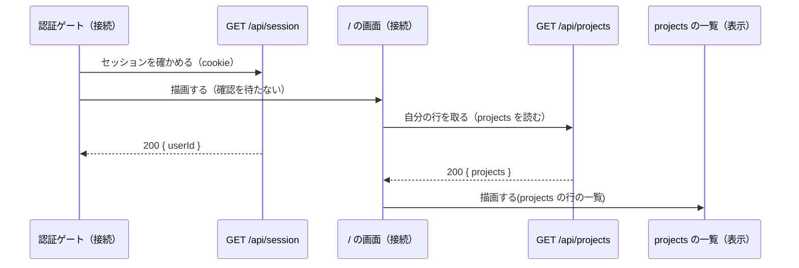
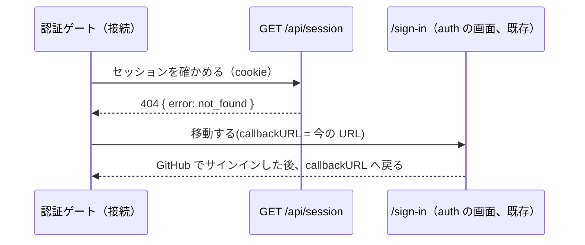
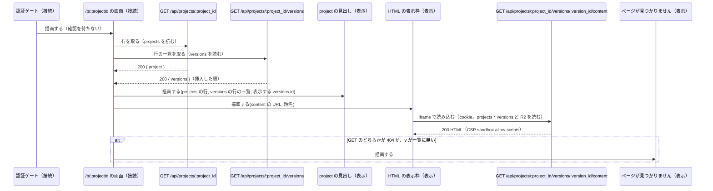
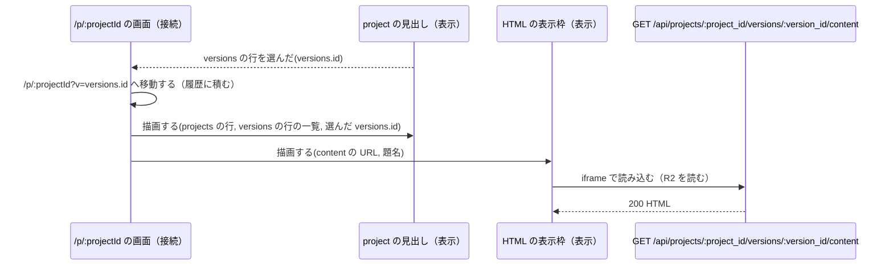
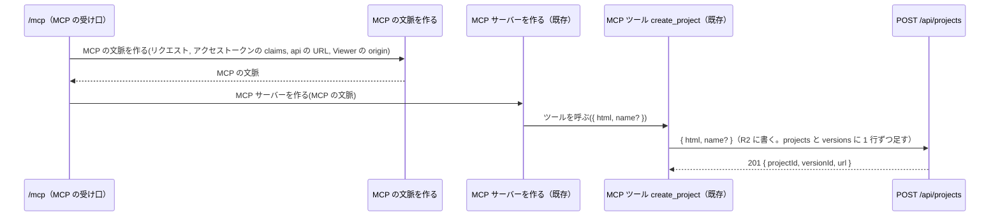
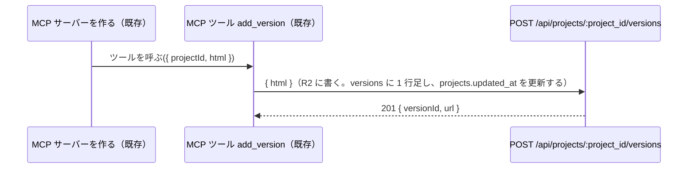
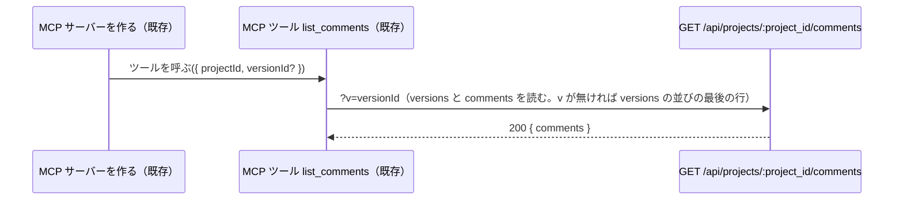
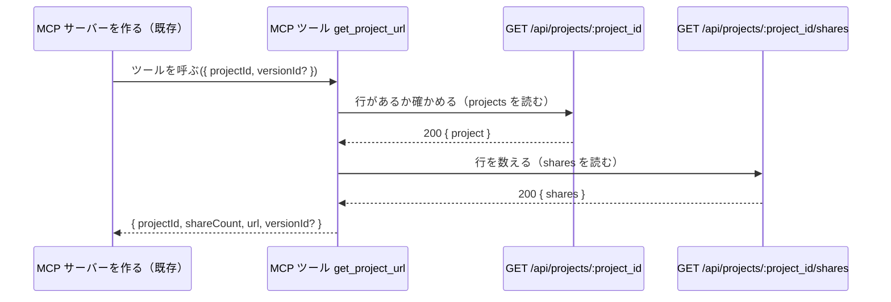
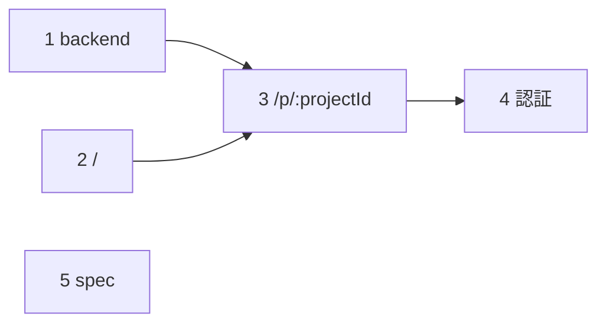

# owner だけが使う Viewer と絶対の表示 URL

## 目的・対象外・未決事項

### 目的

`docs/superpowers/specs/` の仕様のうち未実装の部分を、owner 1 人が使える範囲で作り、spec を今の実装に合わせる。

- Viewer の `/` で自分の `projects` の行の一覧を見て、`/p/:projectId` でその `versions` の行を切り替えながら HTML を表示できる。HTML の中のスクリプトも動く
- 未ログインで Viewer を開くと auth のサインインへ送られ、サインインの後は開いた URL へ戻る
- api と MCP が返す表示 URL を絶対 URL にし、LLM が返したリンクをそのまま開ける
- `versions` の行の並びを挿入した順にし、`versions` に行を足したら `projects.updated_at` も更新する
- spec（overall-arch・interfaces・tech-stack・move-api-auth-to-apps）を今の実装とこの設計に合わせる

### 対象外

- 招待・署名付き URL・`POST /api/projects/:project_id/shares`・auth の `POST /verify-access`（共有の機能と一緒に作る）
- サインアップの制限。今は GitHub でサインインすれば誰でも利用者になれる（招待の機能と一緒に閉じる）
- Viewer の要素単位コメント・HTML 編集・ログアウト・Viewer からの入稿・`shares` の一覧と失効の画面
- 日時（`projects.updated_at`・`versions.created_at`）を画面に出すこと（spec にもデザインにも無い）
- 404 の内訳をサーバのログに残すこと（interfaces-design の「エラーレスポンス形状」）

### 未決事項（仮置き）

1. セッションの確認先は api の `GET /api/session` にする。viewer から auth の get-session を直接呼ぶ案は、auth Worker に viewer 向けの CORS が要り、確かめたいのも「api が受け付けるか」なので取らない
2. HTML の表示枠は iframe の `src` に api の content の URL をそのまま使い、iframe の `sandbox` 属性と content の response の CSP をどちらも `sandbox allow-scripts` にする。スクリプトは opaque origin で動くので、cookie も api への認証付きの request も持てない。`localStorage` などを使うスクリプトは失敗する。R2 に本体が無いときの 404 は iframe の中に出る
3. デプロイの後に手で確かめる（E2E は api と auth を stub するので確かめられない。user と合意）
   - iframe の content の request に cookie が載り、HTML が表示される（viewer と api は同じ site `tsar-bmb.org` なので `SameSite=Lax` でも載る想定）
   - query の付いた callbackURL（`/p/:projectId?v=...`）で、サインインの後に元の URL へ戻る

## 全体の図



## 画面

`/` と `/p/:projectId` は認証ゲートの下に置く。見た目はデザインに任せる（デザインの URL は無い）。

#### /

自分の `projects` の行の一覧。入力は無い。api が返す順（`updated_at` の新しい順）に並べ、各行は `name`（null なら「無題」）を出し、`/p/:projectId` への link にする。0 行なら「まだありません。MCP の create_project で HTML を入稿すると、ここに出ます。」と出す。

- 開く → GET /api/projects。404 のときは何も描画しない（認証ゲートがサインインへ送る）
- 行を押す → `/p/:projectId` へ移動する

#### /p/:projectId?v=<versions.id>

1 つの `projects` の行の HTML を表示する。入力は無い。上に見出し（`/` への link・`projects.name`（null なら「無題」）・`versions` の行の選択）、その下の残りの高さすべてに HTML の表示枠を置く。選択肢は新しい行を上に並べ、ラベルは `versions.id`（UUID）をそのまま出す（user と合意）。

- 開く → GET /api/projects/:project_id と GET /api/projects/:project_id/versions。表示する行は `v` の `versions.id`、`v` が無ければ一覧の最後の行。HTML の表示枠がその行の content を読み込む。GET のどちらかが 404 か、`v` が一覧に無いときは 404 画面を出す
- 選ぶ → `/p/:projectId?v=<versions.id>` へ移動する（履歴に積む）
- `/` への link → `/` へ移動する

#### 404 画面（既存）

どの route にも当たらない path と、`/p/:projectId` の 404 のときに出す。

- 「ホームへ戻る」 → `/` へ移動する

## 流れ

link で画面を移る操作（`/` で行を押す・`/` への link・「ホームへ戻る」）は、移動先の画面を開く流れと同じなので、図を分けない。

### 流れ: / を開く



### 流れ: セッションが無いとき

`/` と `/p/:projectId` で同じ。



### 流れ: /p/:projectId を開く

セッションの確認は「流れ: / を開く」と同じ。



### 流れ: versions の行を選ぶ



### 流れ: MCP で入稿する



### 流れ: MCP で versions の行を足す

MCP サーバーを作るまでは「流れ: MCP で入稿する」と同じ。



### 流れ: MCP でコメントを取る

MCP サーバーを作るまでは「流れ: MCP で入稿する」と同じ。



### 流れ: MCP で表示 URL を取る

MCP サーバーを作るまでは「流れ: MCP で入稿する」と同じ。



## 関数の木

```text
認証ゲート（接続）【4】
├── GET /api/session【4】
├── /sign-in（auth の画面、既存）
├── / の画面（接続）【2】
│   ├── GET /api/projects（既存）
│   └── projects の一覧（表示）【2】【3】
│         受け取る: projects の行の一覧
└── /p/:projectId の画面（接続）【3】
    ├── GET /api/projects/:project_id（既存）
    ├── GET /api/projects/:project_id/versions【1】
    ├── project の見出し（表示）【3】
    │     受け取る: projects の行, versions の行の一覧, 表示する versions.id
    │     知らせる: versions の行を選んだ(versions.id)
    ├── HTML の表示枠（表示）【3】
    │   │ 受け取る: content の URL, 題名（projects.name。null なら「無題」）
    │   └── GET /api/projects/:project_id/versions/:version_id/content【1】
    └── ページが見つかりません（表示）【2】

404 の route（既存）
└── ページが見つかりません【2】

/mcp（MCP の受け口）【1】
├── MCP の文脈を作る(リクエスト, アクセストークンの claims, api の URL, Viewer の origin) → MCP の文脈【1】
│     失敗: アクセストークンか user.id が無い
└── MCP サーバーを作る(MCP の文脈) → MCP サーバー（既存）
    ├── MCP ツール create_project（既存）
    │   └── POST /api/projects【1】
    ├── MCP ツール add_version（既存）
    │   └── POST /api/projects/:project_id/versions【1】
    ├── MCP ツール list_comments（既存）
    │   └── GET /api/projects/:project_id/comments【1】
    └── MCP ツール get_project_url【1】
        ├── GET /api/projects/:project_id（既存）
        └── GET /api/projects/:project_id/shares（既存）
```

## 型と API

### データ

テーブルとカラムは `packages/db/src/schemas/`（meta 用 D1）と `packages/better-auth/src/auth-schema.ts`（auth 用 D1）にあり、この設計では変えない。meta 用 D1 の日時のカラムは epoch 秒の整数（auth 用 D1 はミリ秒）。api は行をカラム名のまま JSON にして返す。

- `projects` の行 = `{ id, name, owner, created_at, updated_at }`。`name` は null 可。`owner` は auth 用 D1 の `user.id`
- `versions` の行 = `{ id, project_id, created_at }`。HTML の本体は R2 の `projects/{project_id}/versions/{id}/index.html`
- `shares` の行 = `{ id, project_id, kind, token, key_id }`
- `versions` の並び【1】: 同じ `project_id` の行を挿入した順に並べる。`created_at` は秒単位で、`id` はランダムな UUID なので、どちらでも同じ秒に入った行の順は決まらない。挿入した順は SQLite の暗黙の `rowid` で取る（`versions` は rowid のあるテーブルで、行を消さないので挿入した順に増える）。カラムは足さない。「最後の行」はこの並びの最後
- MCP の文脈【1】= `{ api の URL, Viewer の origin, アクセストークン, user.id }`。Viewer の origin を足す
- 表示 URL【1】= `<Viewer の origin>/p/<projects.id>`。`versions` の行を指すときは `<Viewer の origin>/p/<projects.id>?v=<versions.id>`
- content の URL = `<api の origin>/api/projects/<projects.id>/versions/<versions.id>/content`
- サインインの URL【4】= `<auth の origin>/sign-in?callbackURL=<encodeURIComponent(今のページの URL)>`

### 設定

- api の `VIEWER_ORIGIN`（既存）= `https://karibari.tsar-bmb.org`。表示 URL の origin にも使う
- remote-mcp の `VIEWER_ORIGIN`【1】= `https://karibari.tsar-bmb.org`。wrangler.jsonc の vars に置く
- viewer の `VITE_API_ORIGIN`（既存）= `https://api.karibari.tsar-bmb.org`。content の URL の origin にも使う
- viewer の `VITE_AUTH_ORIGIN`【4】= `https://auth.karibari.tsar-bmb.org`。`.env` に置く
- api の client（既存）: viewer から api を呼ぶ型付きの client（`@karibari/api/client`）。cookie を送る設定は済んでいる

### API

404 の body はすべて `{ "error": "not_found" }`。認証が無い・無効・auth に問い合わせられないときも、既存の認証の middleware が 404 を返す。JSON の key は既存のものをそのまま書く。

#### GET /api/session（新規）【4】

- 認証: 必須（cookie のセッションか Bearer）。判定は既存の認証の middleware
- request: なし
- response: 200 `{ userId }`（auth 用 D1 の `user.id`）/ 404 セッションが無い

#### POST /api/projects（変更）【1】

- 変えるのは 201 の `url` を絶対の表示 URL にすることだけ。request とほかの status は変えない
- response: 201 `{ projectId, versionId, url }` / 400 入力が不正 / 404 認証が無い

#### POST /api/projects/:project_id/versions（変更）【1】

- `versions` に 1 行足すとき、同じ `projects` の行の `updated_at` を足した行の `created_at` に更新する
- 201 の `url` を、足した行を指す絶対の表示 URL にする
- request: `{ html }`（変えない）
- response: 201 `{ versionId, url }` / 400 入力が不正 / 404 `projects` の行が無いか自分のものではない

#### GET /api/projects/:project_id/versions（変更）【1】

- 変えるのは並びだけ。「データ」の `versions` の並びにする
- response: 200 `{ versions }` / 404

#### GET /api/projects/:project_id/comments（変更）【1】

- 変えるのは `v` が無いときに使う `versions` の行だけ。「データ」の `versions` の並びの最後の行にする
- request: `?v=<versions.id>`（任意）
- response: 200 `{ comments }` / 404

#### GET /api/projects/:project_id/versions/:version_id/content（変更）【1】

- 変えるのは CSP だけ。`Content-Security-Policy: sandbox allow-scripts` にする。`X-Content-Type-Options: nosniff` は残す
- response: 200 HTML（`text/html`）/ 404

#### viewer が使う、変えない API

- GET /api/projects: 200 `{ projects }`（`updated_at` の新しい順）/ 404 認証が無い
- GET /api/projects/:project_id: 200 `{ project }` / 404

#### MCP ツール get_project_url（変更）【1】

- 入力: `{ projectId, versionId? }`（変えない）
- 出力: `{ projectId, shareCount, url, versionId? }`。変えるのは `url` を絶対の表示 URL にすることだけ。`versionId` が無ければ `versions` の行を指さない表示 URL
- 使う API: GET /api/projects/:project_id と GET /api/projects/:project_id/shares（既存）

## ファイルとフェーズ



次のファイルは、直列のフェーズが順に書き足す（user と合意。直列なので同時には触らない）。`apps/viewer/src/router.tsx` は 2 → 3 → 4、`apps/viewer/test/helpers/api-stub.ts` は 2 → 3 → 4、`apps/viewer/src/components/project-list.tsx` は 2 → 3。それ以外のファイルは 1 フェーズだけが持つ。

| ファイル | 新規・変更 | 中身 | フェーズ |
| --- | --- | --- | --- |
| apps/api/src/routes/projects/index.post.ts | 変更 | POST /api/projects | 1 |
| apps/api/src/routes/projects/[project_id]/versions/index.post.ts | 変更 | POST /api/projects/:project_id/versions | 1 |
| apps/api/src/routes/projects/[project_id]/versions/index.get.ts | 変更 | GET /api/projects/:project_id/versions | 1 |
| apps/api/src/routes/projects/[project_id]/comments/index.get.ts | 変更 | GET /api/projects/:project_id/comments | 1 |
| apps/api/src/routes/projects/[project_id]/versions/[version_id]/content.get.ts | 変更 | GET /api/projects/:project_id/versions/:version_id/content | 1 |
| apps/api/test/routes/projects/index.post.spec.ts | 変更 | `url` の期待値を絶対の表示 URL にする | 1 |
| apps/api/test/routes/projects/[project_id]/versions/index.post.spec.ts | 変更 | `url` の期待値と、`projects.updated_at` の更新 | 1 |
| apps/api/test/routes/projects/[project_id]/versions/index.get.spec.ts | 変更 | 同じ `created_at` の行が挿入した順に並ぶこと | 1 |
| apps/api/test/routes/projects/[project_id]/comments/index.get.spec.ts | 変更 | `v` が無いとき、同じ `created_at` の `versions` の行のうち最後に挿入した行を使うこと | 1 |
| apps/api/test/routes/projects/[project_id]/versions/[version_id]/content.get.spec.ts | 変更 | CSP の期待値 | 1 |
| packages/mcp/src/mcp-context.ts | 変更 | MCP の文脈（型）・MCP の文脈を作る | 1 |
| packages/mcp/src/tools/get-project-url-tool.ts | 変更 | MCP ツール get_project_url | 1 |
| packages/mcp/test/features/*.spec.ts | 変更 | MCP の文脈に Viewer の origin を足す。get_project_url の `url` の期待値を絶対 URL にする | 1 |
| apps/remote-mcp/src/routes/mcp.ts | 変更 | /mcp（MCP の受け口） | 1 |
| apps/remote-mcp/wrangler.jsonc | 変更 | vars に `VIEWER_ORIGIN` を足す | 1 |
| apps/remote-mcp/worker-configuration.d.ts | 変更 | `mise run cf-typegen` で作り直す（生成物） | 1 |
| apps/viewer/src/router.tsx | 変更 | `/` の route を登録する | 2 |
| apps/viewer/src/routes/home.tsx | 新規 | / の画面 | 2 |
| apps/viewer/src/components/project-list.tsx | 新規 | projects の一覧 | 2 |
| apps/viewer/src/components/not-found.tsx | 変更 | ページが見つかりません | 2 |
| apps/viewer/test/helpers/api-stub.ts | 新規 | E2E で api と auth への request を stub する補助 | 2 |
| apps/viewer/test/e2e/home.spec.ts | 新規 | E2E: `/` で行を押すと `/p/:projectId` へ移動する | 2 |
| knip.config.ts | 変更 | `apps/viewer` の `entry` の指定とそのコメントを外す | 2 |
| apps/viewer/src/router.tsx | 変更 | `/p/:projectId` の route を登録する | 3 |
| apps/viewer/src/components/project-list.tsx | 変更 | projects の一覧 | 3 |
| apps/viewer/src/routes/project.tsx | 新規 | /p/:projectId の画面 | 3 |
| apps/viewer/src/components/project-header.tsx | 新規 | project の見出し | 3 |
| apps/viewer/src/components/html-frame.tsx | 新規 | HTML の表示枠 | 3 |
| apps/viewer/test/e2e/project.spec.ts | 新規 | E2E: 行を選ぶ・`/` へ戻る・404 から戻る | 3 |
| apps/viewer/test/e2e/not-found.spec.ts | 変更 | どの route にも当たらない path で開く | 3 |
| apps/viewer/test/helpers/api-stub.ts | 変更 | `/p/:projectId` の E2E に要る stub があれば足す | 3 |
| apps/api/src/routes/session/index.get.ts | 新規 | GET /api/session | 4 |
| apps/api/src/server.ts | 変更 | `/api/session` の route を chain に足す | 4 |
| apps/api/test/routes/session/index.get.spec.ts | 新規 | セッションがあれば 200 `{ userId }`、無ければ 404 | 4 |
| apps/viewer/src/router.tsx | 変更 | 認証ゲートを足し、`/` と `/p/:projectId` をその下に移す | 4 |
| apps/viewer/src/routes/session-gate.tsx | 新規 | 認証ゲート | 4 |
| apps/viewer/.env | 変更 | `VITE_AUTH_ORIGIN` を足す | 4 |
| apps/viewer/src/vite-env.d.ts | 変更 | `VITE_AUTH_ORIGIN` の型を足す | 4 |
| apps/viewer/test/helpers/api-stub.ts | 変更 | 既定で GET /api/session を 200 にする | 4 |
| apps/viewer/test/e2e/session-gate.spec.ts | 新規 | E2E: セッションが無いとサインインへ移動する | 4 |
| docs/superpowers/specs/2026-09-09-overall-arch-design.md | 変更 | phase-5-spec.md の一覧のとおり直す | 5 |
| docs/superpowers/specs/2026-09-09-interfaces-design.md | 変更 | phase-5-spec.md の一覧のとおり直す | 5 |
| docs/superpowers/specs/2026-09-09-tech-stack-design.md | 変更 | phase-5-spec.md の一覧のとおり直す | 5 |
| docs/superpowers/specs/2026-09-11-move-api-auth-to-apps-design.md | 変更 | phase-5-spec.md の一覧のとおり直す | 5 |
| apps/api/src/middlewares/auth.ts | 既存 | 認証の middleware | — |
| apps/api/src/routes/projects/index.get.ts | 既存 | GET /api/projects | — |
| apps/api/src/routes/projects/[project_id]/index.get.ts | 既存 | GET /api/projects/:project_id | — |
| apps/api/src/routes/projects/[project_id]/shares/index.get.ts | 既存 | GET /api/projects/:project_id/shares | — |
| packages/mcp/src/index.ts | 既存 | MCP サーバーを作る | — |
| packages/mcp/src/tools/create-project-tool.ts | 既存 | MCP ツール create_project | — |
| packages/mcp/src/tools/add-version-tool.ts | 既存 | MCP ツール add_version | — |
| packages/mcp/src/tools/list-comments-tool.ts | 既存 | MCP ツール list_comments | — |
| apps/viewer/src/lib/api-client.ts | 既存 | api の client | — |

## 記法

```text
関数       名前(引数, …) → 戻り値。戻り値が無ければ → を書かない
           失敗するときは、次の行に「失敗: 理由, …」
component  名前（表示 または 接続）。次の行に「受け取る: …」「知らせる: 名前(引数)」
形         { 項目, 項目? }。項目? は無いことがある。X[] は X の一覧。A | B はどちらか
型         名前から分からないときだけ「役割: owner | member」のように書く
印         【N】はフェーズ N で作る・変えるもの。（既存）は今あるものを使う
データ     DB のテーブルとカラムの名前で書く（versions.created_at）。既存の API の JSON は実際の key で書く
```
